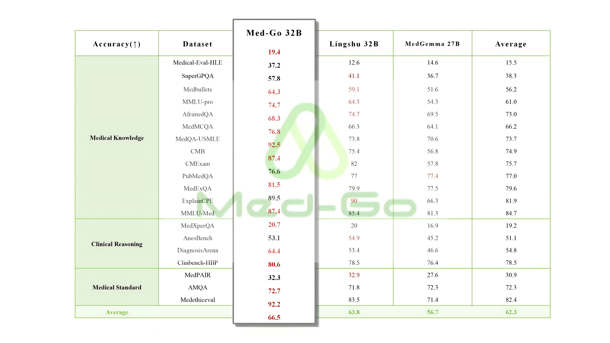

# MedGo: 基于 Qwen3-32B 的医疗大模型

<div align="center">

[](https://huggingface.co/OpenMedZoo/MedGo)
[](LICENSE)
[](https://www.python.org/)

[English](./README.md) | 简体中文

</div>


## 📋 目录

- [简介](#简介)
- [模型特点](#模型特点)
- [性能评估](#性能评估)
- [快速开始](#快速开始)
- [训练细节](#训练细节)
- [使用场景](#使用场景)
- [限制与风险](#限制与风险)
- [引用](#引用)
- [许可证](#许可证)
- [贡献](#贡献)
- [联系方式](#联系方式)

## 🎯 简介

**MedGo** 是一个基于 **Qwen3-32B** 微调的通用医疗大语言模型，专为临床医学与科研场景设计。模型通过大规模多源医学语料和复杂病例数据增强进行训练，支持医学问答、病历摘要、临床推理、多轮对话和科研文本生成等多任务能力。

### 🌟 核心能力

- **📚 医学知识问答**: 基于权威医学文献和临床指南的专业问答
- **📝 病历文书生成**: 自动化病历摘要、诊断报告和医疗文书
- **🔍 临床推理**: 鉴别诊断、检查建议和治疗方案推荐
- **💬 多轮对话**: 医患交互模拟和复杂病例讨论
- **🔬 科研辅助**: 文献摘要、研究思路生成和质控审查

## ✨ 模型特点

| 特性 | 详情 |
|------|------|
| **基础架构** | Qwen3-32B |
| **参数规模** | 32B |
| **应用领域** | 临床医学、科研辅助、医疗系统集成 |
| **微调方法** | SFT + Preference Alignment (DPO/KTO) |
| **数据来源** | 权威医学文献、临床指南、真实病例（脱敏） |
| **部署方式** | 本地部署、HIS/EMR 系统集成 |
| **开源许可** | Apache 2.0 |

## 📊 性能评估

MedGo 在多项医学与综合评测基准上表现优异，在 32B 参数级别模型中具有竞争力：

### 主要基准测试结果

- **AIMedQA**: 医学问答理解
- **CME**: 临床推理评估
- **DiagnosisArena**: 诊断能力测试
- **MedQA / MedMCQA**: 医学选择题
- **PubMedQA**: 生物医学文献问答
- **MMLU-Pro**: 综合能力评估



**性能亮点**：
- ✅ **平均得分**: 约 70 分（32B 级别模型中表现优异）
- ✅ **优势任务**: 临床推理（DiagnosisArena、CME）和多轮医学问答
- ✅ **平衡能力**: 在医疗语义理解和多任务泛化上表现良好


## 🚀 快速开始

### 环境要求

- Python >= 3.8
- PyTorch >= 2.0
- Transformers >= 4.35.0
- CUDA >= 11.8 (GPU 推理)

### 安装

```bash
# 克隆仓库
git clone https://github.com/OpenMedZoo/MedGo.git
cd MedGo

# 安装依赖
pip install -r requirements.txt
```

### 模型下载

从 HuggingFace 下载模型权重：

```bash
# 使用 huggingface-cli
huggingface-cli download OpenMedZoo/MedGo --local-dir ./models/MedGo

# 或使用 git-lfs
git lfs install
git clone https://huggingface.co/OpenMedZoo/MedGo
```

### 基础推理

```python
from transformers import AutoModelForCausalLM, AutoTokenizer

# 加载模型和分词器
model_path = "OpenMedZoo/MedGo"
tokenizer = AutoTokenizer.from_pretrained(model_path, trust_remote_code=True)
model = AutoModelForCausalLM.from_pretrained(
    model_path,
    device_map="auto",
    trust_remote_code=True,
    torch_dtype="auto"
)

# 医学问答示例
messages = [
    {"role": "system", "content": "你是一个专业的医疗助手，请基于医学知识回答问题。"},
    {"role": "user", "content": "请解释什么是高血压，以及常见的治疗方法。"}
]

# 生成回复
inputs = tokenizer.apply_chat_template(
    messages, 
    tokenize=True, 
    add_generation_prompt=True,
    return_tensors="pt"
).to(model.device)

outputs = model.generate(
    inputs,
    max_new_tokens=512,
    temperature=0.7,
    top_p=0.9,
    do_sample=True
)

response = tokenizer.decode(outputs[0][len(inputs[0]):], skip_special_tokens=True)
print(response)
```

### 批量推理

```bash
# 使用提供的推理脚本
python scripts/inference.py \
    --model_path OpenMedZoo/MedGo \
    --input_file examples/medical_qa.jsonl \
    --output_file results/predictions.jsonl \
    --batch_size 4
```

### vLLM 加速推理

```python
from vllm import LLM, SamplingParams

# 初始化 vLLM
llm = LLM(model="OpenMedZoo/MedGo", trust_remote_code=True)
sampling_params = SamplingParams(temperature=0.7, top_p=0.9, max_tokens=512)

# 批量推理
prompts = [
    "请解释糖尿病的症状和治疗方法。",
    "高血压患者应该注意哪些饮食事项？"
]

outputs = llm.generate(prompts, sampling_params)
for output in outputs:
    print(output.outputs[0].text)
```

## 🔧 训练细节

MedGo 采用**两阶段微调策略**，兼顾通用医学知识与临床任务适配。

### 阶段 I：通识医学对齐

**目标**: 建立扎实的医学知识基础，提高问答规范性

- **数据来源**:
  - 权威医学文献（PubMed、医学教科书）
  - 临床指南和诊疗规范
  - 医学百科条目和术语库
  
- **训练方法**:
  - Supervised Fine-Tuning (SFT)
  - Chain-of-Thought (CoT) 引导样本
  - 医学术语对齐和安全性约束

### 阶段 II：临床任务增强

**目标**: 增强复杂病例推理和多任务处理能力

- **数据来源**:
  - 真实病历（完全脱敏处理）
  - 门急诊记录和复杂多诊断样本
  - 科研文章和质控案例
  
- **数据增强技术**:
  - 语义改写和多视角扩写
  - 复杂病例合成
  - 医患交互模拟
  
- **训练方法**:
  - Multi-Task Learning（病历摘要、鉴别诊断、检查建议等）
  - Preference Alignment (DPO/KTO)
  - 专家反馈迭代优化

### 训练优化重点

- ✅ 强化复杂病例的信息抽取与跨证据推理
- ✅ 提升输出的医学一致性和可解释性
- ✅ 优化表达的合规性和安全性
- ✅ 通过专家样本和自动评测持续迭代

## 💡 使用场景

### ✅ 适用场景

| 场景 | 说明 |
|------|------|
| **临床辅助** | 初步诊断建议、病历书写、格式化报告生成 |
| **科研支持** | 文献摘要、研究思路生成、数据分析辅助 |
| **质控审查** | 医疗文书规范性检查、诊疗流程质控 |
| **系统集成** | 嵌入 HIS/EMR 系统，提供智能辅助决策 |
| **医学教育** | 病例讨论、医学知识问答、临床推理训练 |

### 🚫 不适用场景

- ❌ **不能替代医生**: 仅为辅助工具，不能单独作为诊断依据
- ❌ **高风险操作**: 不建议用于手术决策等高风险医疗操作
- ❌ **罕见病局限**: 对训练数据外的罕见病表现可能欠佳
- ❌ **实时急救**: 不适用于需要即时决策的急救场景

## ⚠️ 限制与风险

### 模型局限性

1. **理解偏差**: 虽已覆盖大量医学知识，仍可能出现理解偏差或错误推荐
2. **复杂病例**: 对病情复杂、并发症严重、资料缺失的病例风险较高
3. **知识时效**: 医学知识持续更新，模型训练数据可能滞后
4. **语言限制**: 主要针对中文医学场景，其他语言表现可能不佳

### 使用建议

- ⚠️ 请在受控环境中使用，并由临床专家审核生成结果
- ⚠️ 将模型输出作为辅助参考，而非最终诊断依据
- ⚠️ 对敏感病案或高风险场景，必须结合专家意见
- ⚠️ 部署前需通过内部验证、安全审查和临床测试

### 数据隐私与合规

- 🔒 训练数据已完全脱敏处理
- 🔒 使用时注意患者隐私保护
- 🔒 生产环境部署需符合医疗数据安全法规（如 HIPAA、GDPR）
- 🔒 建议在本地部署，避免敏感数据外传

## 📚 引用

如果 MedGo 对您的研究或项目有帮助，请引用我们的工作：

```bibtex
@misc{openmedzoo_2025,
	author       = { OpenMedZoo },
	title        = { MedGo (Revision 640a2e2) },
	year         = 2025,
	url          = { https://huggingface.co/OpenMedZoo/MedGo },
	doi          = { 10.57967/hf/7024 },
	publisher    = { Hugging Face }
}
```

## 📄 许可证

本项目采用 [Apache License 2.0](LICENSE) 开源协议。

**商业使用须知**：
- ✅ 允许商业使用和修改
- ✅ 需保留原始许可证和版权声明
- ✅ 医疗系统集成建议联系我们获取技术支持

## 🤝 贡献

我们欢迎社区贡献！以下是参与方式：

### 贡献类型

- 🐛 提交 Bug 报告
- 💡 提出新功能建议
- 📝 改进文档
- 🔧 提交代码修复或优化
- 📊 分享评测结果和使用案例

## 🙏 致谢

感谢所有参与 MedGo 项目的人员：

- 模型研发与微调算法团队
- 数据标注与质量控制团队
- 临床专家指导与审核团队
- 开源社区的支持与反馈

特别感谢：
- [Qwen Team](https://github.com/QwenLM/Qwen) 提供优秀的基础模型
- 所有提供数据和反馈的医疗机构

## 版权声明
- 发布单位：同济大学附属东方医院｜唯一通信作者
- 联合研发单位：上海烁乐科技有限公司（提供技术支持）
- 联系方式：dongfyy@pudong.gov.cn
- 版本：v1.0
- 署名/引用：使用或再发布时请注明来源与版本号 
“Powered by Med-Go32B, released by Tongji University Affiliated East Hospital (v1.0).”

## 📧 联系方式

- **HuggingFace**: [模型主页](https://huggingface.co/OpenMedZoo/MedGo)

---

<div align="center">


[⬆ 回到顶部](#medgo-基于-qwen25-32b-的医疗大模型)

</div>
